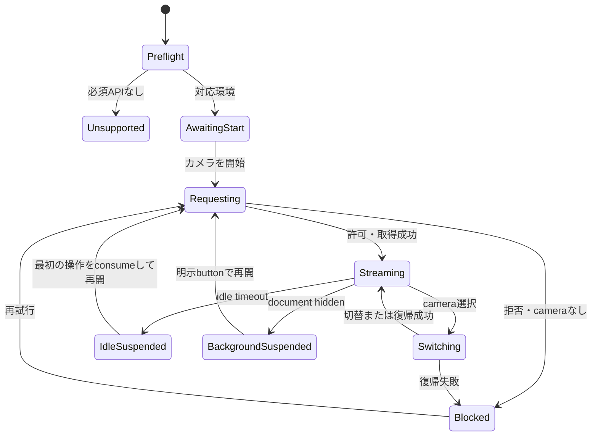
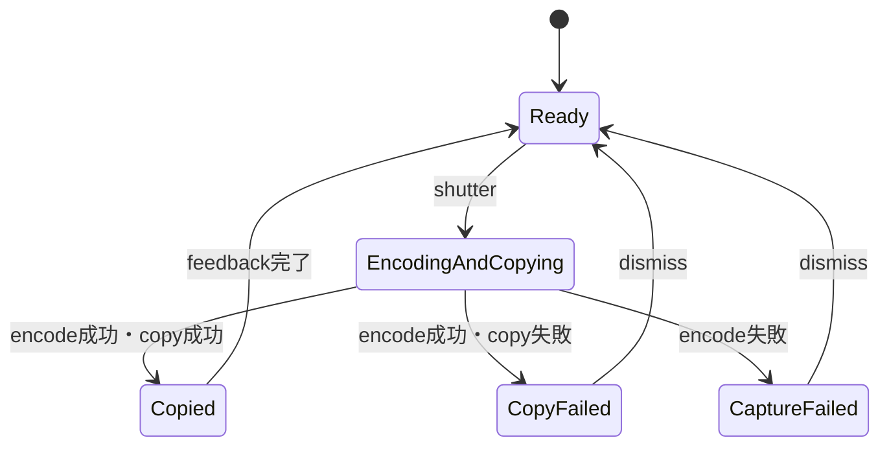
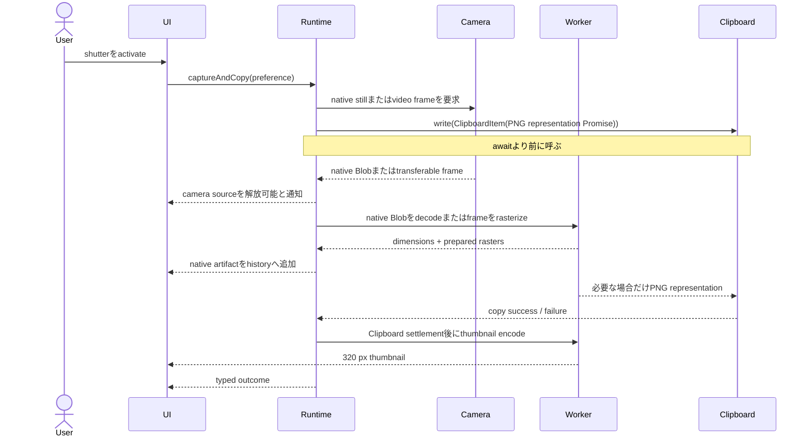
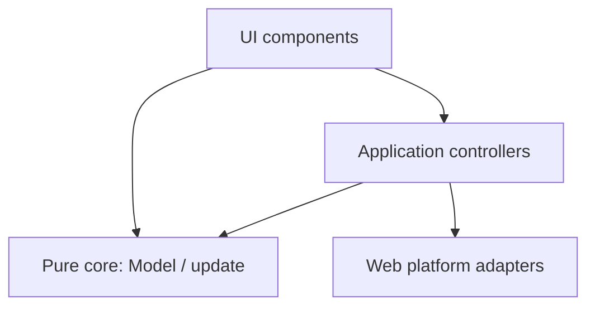

# Camera Clipboard Web App 設計書

| 項目 | 内容 |
| --- | --- |
| 文書状態 | V2 Phase 7 acceptance / memory hardeningまでの実装設計 |
| Version | 0.7.0 |
| 作成日 | 2026-08-30 |
| 仮称 | Camera Clipboard |
| 対象 | mobile / tablet / desktop のmodern browser |
| Repository | [`bem130/webcam-app`](https://github.com/bem130/webcam-app) |
| Production URL | `https://bem130.github.io/webcam-app/` |

## 0. 方針

本アプリを「cameraのnative stillまたは現在frameを一度の操作でsystem Clipboardへコピーする、小さなclient-side utility」と定義する。中心となる設計上の注意点は次の四点である。

1. アプリ自身は撮影画像を永続化せず、serverへ送信しない。撮影履歴は現在のdocumentが生存している間だけmemory上に保持する。
2. 撮影とClipboard書込みを一つの明確なprimary actionにまとめる。camera切替と履歴参照は常に短い操作で到達可能にする。
3. Apple Human Interface Guidelines（以下、Apple HIG）のclarity、hierarchy、consistency、feedback、privacy、accessibilityをWebへ適用する。ただしnative iOS UIの表層的な模倣は行わず、Webの標準操作も尊重する。
4. platform APIへの依存を境界へ集約し、domain state・状態遷移・errorを型で表す。GUI主体の小規模WebアプリであるためTypeScriptを採用し、不要なRust/Wasm層は設けない。

## 1. Product definition

### 1.1 一文での定義

camera previewを表示し、shutterを押すと静止画をClipboardへコピーすると同時に、reloadまで参照できるin-memory履歴へ追加するWebアプリである。

### 1.2 解決する課題

一般的なcamera appでは「撮影 → 写真libraryへ保存 → 対象appで選択・貼付」という経路になる。本アプリは「撮影 → Clipboardへcopy → 対象appへpaste」という短い経路を提供し、写真libraryへ画像を残さない。

### 1.3 成功条件

- 初回のcamera開始後、通常の撮影は一回のtap/clickで完了する。
- camera切替は一回のtapで直前のcameraと切り替えられ、任意のcameraも二回以内の操作で選択できる。
- copyの成功・失敗が即時に判別できる。
- copyに失敗しても撮影済み画像は履歴に残り、再copyできる。
- reload、tab close、browser process終了のいずれかで履歴が消える。
- アプリ起因の永続的な画像保存と画像送信が発生しない。

## 2. Scope

### 2.1 v1に含める機能

| ID | 機能 | 優先度 |
| --- | --- | --- |
| FR-01 | user actionを起点としたcamera permission要求 | 必須 |
| FR-02 | live camera preview | 必須 |
| FR-03 | 写真API優先または現在video frameによる撮影とClipboardへのcopy | 必須 |
| FR-04 | 撮影画像のin-memory履歴 | 必須 |
| FR-05 | 履歴画像のpreviewと再copy | 必須 |
| FR-06 | 複数cameraの列挙、任意選択、quick swap | 必須 |
| FR-07 | 個別削除と全履歴消去 | 必須 |
| FR-08 | camera・Clipboard・encodeのtyped error表示と回復操作 | 必須 |
| FR-09 | mobile / tablet / desktop responsive layout | 必須 |
| FR-10 | keyboard、screen reader、reduced motion対応 | 必須 |
| FR-11 | camera接続・切断への追従 | 推奨 |
| FR-12 | tabがbackgroundへ移った際のcamera suspendと復帰 | 推奨 |
| FR-13 | browser / OS標準UIからのPWA install | 必須 |
| FR-14 | `photoPreferred` / `videoFrame`の永続設定とactual route表示 | 必須 |
| FR-15 | 10秒〜10分またはoffのidle timeout永続設定 | 必須 |

### 2.2 v1に含めない機能

- 写真library、filesystem、download folderへの保存
- `localStorage`、IndexedDB、Cache Storage、OPFS等への画像保存
- server upload、account、同期、共有link
- 動画撮影、音声取得、連写、timer、filter、crop、markup
- galleryからの画像import
- OCR、QR code認識、document scan補正
- Service Workerによる撮影画像のcache
- offline利用とapp shellのService Worker cache
- native app固有API、Apple Camera Controlへの対応

### 2.3 前提

- top-level documentとしてHTTPSで配信する。`localhost`はdevelopment用途に限り許容する。
- cameraとimage Clipboard writeを実装するmodern browserを対象とする。
- microphone permissionは一切要求しない。
- Clipboardは「現在の一項目を置換する」system resourceであり、撮影ごとに直前のClipboard内容を置換する。

## 3. Data and privacy contract

### 3.1 「保存しない」の定義

本設計で「アプリが保存しない」とは、アプリが取得したcamera frameまたは生成画像を、次の場所へ意図的に書き込まないことをいう。

- application serverまたはthird-party server
- browserのpersistent storage
- filesystemまたはdownload領域
- Service Worker cache
- analytics、logging、error reporting service

許可される保持先は次の二つだけである。

1. 現在のWeb documentに属するmemory
2. userの明示操作によって書き込まれるsystem Clipboard

### 3.2 責任境界

| 層 | 本アプリの契約 |
| --- | --- |
| Application | 画像をmemoryとClipboard以外へ書かず、network送信しない。reload時の復元手段を持たない。 |
| Browser | permission、camera indicator、process memory、Clipboard APIの実装はbrowserが管理する。 |
| OS | Clipboard履歴、swap、crash dump、device間Clipboard同期等はOS設定と実装が管理する。 |
| Paste先app | 貼付後の保存、送信、加工は貼付先appが管理する。 |

AppleのUniversal Clipboardが有効な環境では、copyした画像が近くの同一Apple Account端末のClipboardへ一時的に追加され得る。これはClipboardの期待されたsystem behaviorであり、本アプリによる画像送信とは区別する。[Apple Support: Universal Clipboard](https://support.apple.com/en-hk/102430)

### 3.3 保証するinvariant

- **P-01:** `audio: false`を常に指定し、audio trackを取得しない。
- **P-02:** captureは可視かつenabledなshutterまたは履歴の「再コピー」操作からのみ開始する。
- **P-03:** 画像をrequest body、URL、cookie、telemetry payload、console logへ含めない。
- **P-04:** 履歴はmodule-level global、DOM attribute、URL、history stateへ埋め込まず、application state内だけに保持する。
- **P-05:** reload後に履歴を復元しない。
- **P-06:** 削除したentryのObject URLを直ちにrevokeする。
- **P-07:** document破棄時に全camera trackをstopし、全Object URLをrevokeする。
- **P-08:** Clipboard書込みの事実と対象時刻はUIに表示してよいが、画像内容はlogへ出さない。
- **P-09:** Web Storageへ保存するのはversion付きのidle timeoutとcapture preferenceだけとし、画像・device情報・timingを含めない。

## 4. User experience

### 4.1 初回起動

初期画面ではcamera permissionを自動要求しない。次の短い説明とprimary buttonを表示する。

> 撮影すると画像をClipboardへコピーする。画像はserverや端末の写真libraryへ保存しない。履歴はこのtabを再読み込みするまで保持する。copy後の扱いは端末のClipboard設定に従う。

Primary buttonは「カメラを開始」とする。buttonのactivationと同じuser interaction内で`getUserMedia()`を呼ぶ。Apple HIGのprivacy guidanceに従い、protected resourceが必要になった文脈でpermissionを求める。[Apple HIG: Privacy](https://developer.apple.com/design/human-interface-guidelines/privacy)

起動前に次のcapability checkを行う。

- `window.isSecureContext`
- `navigator.mediaDevices?.getUserMedia`
- `navigator.mediaDevices?.enumerateDevices`
- `navigator.clipboard?.write`
- `globalThis.ClipboardItem`

必須capabilityが欠ける場合はpermissionを要求せず、未対応理由を表示する。

### 4.2 Camera view

live previewを画面の主役とし、常設controlは最小限にする。

| 位置 | Control | 動作 |
| --- | --- | --- |
| 上部中央 | 現在camera名のselector pill | camera一覧をmenuとして開く |
| 上部右 | camera稼働表示 | 「カメラ使用中」をiconとtextで示す |
| 上部中央 | 撮影方式selector | 写真優先または動画フレームを選択する。写真API非対応時は写真優先をdisabledにする |
| 下部左 | 最新履歴thumbnail + 件数badge | 履歴を開く |
| 下部中央 | shutter | 撮影し、履歴追加とClipboard copyを行う |
| 下部右 | camera quick swap | 現在cameraと直前cameraを切り替える |

cameraが一台だけの場合、quick swapは非表示とし、空いた場所をclickableにしない。camera labelが取得できない段階では「カメラ 1」のようなordinal labelを用い、permission取得後に実labelへ更新する。`enumerateDevices()`はpermission前に非default deviceやlabelを十分に公開しないためである。[MDN: enumerateDevices()](https://developer.mozilla.org/en-US/docs/Web/API/MediaDevices/enumerateDevices)

### 4.3 撮影とcopy

1. userがshutterをactivateする。
2. 画面全体へ80 ms以下の軽いwhite flashを表示する。`prefers-reduced-motion: reduce`ではflashを省略する。
3. configured `CapturePreference`をruntime capabilityへ解決する。defaultの`photoPreferred`では`ImageCapture.takePhoto()`を試し、非対応・失敗時だけvideo-frame PNGへfallbackする。`videoFrame`では写真APIを呼ばない。
4. 同じ操作のuser activationを失う前に、portableな`image/png` Clipboard representationのwriteを開始する。
5. native Blobまたはvideo-frame PNGのcapture artifact完成時点で、thumbnailとClipboard変換・settlementから独立して履歴へ追加する。
6. Clipboard成功時は「Clipboardにコピーした」を短いstatus pillとscreen reader live regionへ表示する。
7. Clipboard失敗時は「撮影したが、コピーできなかった」を表示し、「再コピー」を提供する。

処理中はshutter内部をactivity indicatorへ変え、二重activationを防ぐ。Apple HIGは完了に時間を要するbuttonでactivity indicatorを使うこと、重要actionの成功・失敗をfeedbackで伝えることを推奨している。[Apple HIG: Buttons](https://developer.apple.com/design/human-interface-guidelines/buttons) / [Apple HIG: Feedback](https://developer.apple.com/design/human-interface-guidelines/feedback)

### 4.4 Camera切替

camera切替には二つの経路を提供する。

- **Quick swap:** 下部右buttonを一回tapし、現在cameraと直前に使用した別cameraを交換する。初回はdevice list上の次cameraへ進む。
- **Exact selection:** 上部camera selectorを開き、label付き一覧から任意cameraを選ぶ。

switch中は最後のframeを静止表示し、中央へ小さなactivity indicatorを重ねる。新camera取得に失敗した場合は旧cameraへの復帰を一度試みる。復帰にも失敗した場合はcamera stopped stateへ移り、「カメラを再開」を表示する。

別deviceIdへの変更は、既存trackへ`applyConstraints()`する方式を採らない。W3C Media Capture仕様上、trackの`deviceId`は同じsourceについて固定であり、別deviceへの変更は新しい`getUserMedia()` requestで行う。[W3C: Media Capture and Streams](https://www.w3.org/TR/mediacapture-streams/)

### 4.5 History

- newest firstのgridとして表示する。
- 各entryはthumbnail、撮影時刻、pixel dimensions、概算sizeを持つ。
- thumbnail activationでdetail previewを開く。
- detailには「再コピー」と「削除」を置く。
- 「すべて消去」はdestructive actionとして明示し、確認dialogを一度表示する。
- 履歴が空なら「このtabで撮影した画像がここに表示される」と説明する。
- reload、tab close、document crash後の復元UIは提供しない。

mobileではbottom sheet、幅1024 px以上では右side panelとして表示する。履歴を開いてもcamera streamは維持するが、shutterは隠して誤撮影を防ぐ。

### 4.6 Backgroundと復帰

- `document.visibilityState === "hidden"`になったら全trackを`stop()`し、videoの`srcObject`とstream referenceを解放する。
- visibleへ戻ってもcameraを自動取得しない。停止理由を表示し、明示的な「カメラを再開」操作で保持したcamera IDを再要求する。
- background中のrequest完了や古いcamera switch結果はtransaction IDでstaleとして扱い、取得できたstreamを直ちにstopする。
- `pagehide`またはdocument破棄時はtrackをstopする。

backgroundではsoft disableに依存せず、applicationがhardware releaseを要求したことを`stop()`で保証する。[W3C: MediaStreamTrack lifecycle](https://www.w3.org/TR/mediacapture-streams/)

### 4.7 Idle停止

- camera stream開始からdefault 10秒のtimerをarmし、`pointerdown`、`keydown`、`wheel`でresetする。`pointermove`はactivityに含めない。
- timeout時はbackgroundと同じhard stopを行うが、停止理由は`idle | background`として区別する。
- native stillは`takePhoto()`がBlobを返すまで、video frameはWorkerまたはCanvasがPNG artifactを返すまでidle停止を抑止する。
- native Blob取得後のdecode、Clipboard用PNG変換、Clipboard settlement、thumbnailはcameraを必要としないためidle停止を抑止しない。
- camera切替中は旧streamを先にstopしてtimerを解除し、新stream接続後に新しいtimerをarmする。撮影中のcamera切替と撮影方式変更は無効化する。

### 4.8 Idle screensaverと復帰

- idle停止時はcamera previewとcontrolを通常documentの全画面screensaverで覆う。background停止は理由を明示したcardとbuttonを維持し、resume triggerを混同しない。
- screensaver自身が`pointerdown`、`keydown`、`wheel`をconsumeし、最初のinteractionではcamera resumeだけを開始する。`pointermove`はresumeにもstreaming中のidle resetにも使わない。
- pointerdown後に同じgestureのclickが続いてもlocal guardとcamera request guardで一度しか再開しない。背後のshutter、history、camera selectorへeventを伝播させない。
- screensaverは表示時にfocusを受け、accessible nameとlive statusを提供する。再開中はapp statusで通知し、成功後はshutterへfocusを戻す。失敗時は既存のtyped camera errorと再試行buttonへ遷移する。
- screensaverはtransitionとanimationを持たず、320×568を含むviewport全体とsafe areaを覆う。

### 4.9 Preferences

- camera topbarのsettings buttonから`<dialog>.showModal()`によるtop-layer modalを開き、撮影方式とcamera自動停止時間を変更する。
- `IdleTimeout`は`10s | 30s | 1m | 3m | 5m | 10m | off`、`CapturePreference`は`photoPreferred | videoFrame`のclosed unionとする。
- version付きpayload `{ version: 1, idleTimeout, capturePreference }`だけを`src/platform/preferences.ts`から`localStorage`へ保存する。画像、Blob、dimensions、Object URL、device情報をportの型へ含めない。
- missing、invalid、追加field、future version、JSON parse failure、SecurityError、quota errorは`10s / photoPreferred`へfallbackし、camera起動を妨げない。
- unsupported cameraではruntimeのeffective routeとsettings表示を`videoFrame`にするが、stored `photoPreferred`は暗黙に書き換えない。
- timeout変更時はactive timerをcancelして新しい値でrearmする。`off`は稼働中cameraを停止せず、automatic idle stopだけを無効にする。
- browser tabとinstalled PWAは同一originのWeb Storageを共有し得る。撮影履歴は従来どおりreloadで消える。

## 5. Layout and visual design

### 5.1 Apple HIGの適用方法

| HIG上の観点 | 本アプリへの適用 |
| --- | --- |
| Clarity | primary actionをshutter一つに限定し、各iconへaccessible nameを付ける。 |
| Hierarchy | camera previewを最大領域とし、controlはedgeへ集約する。 |
| Consistency | camera、switch、history、copy、deleteに一般的なsymbolと用語を使う。 |
| Feedback | shutter flash、progress、success、failureを視覚・textの両方で示す。 |
| Privacy | 必要になるまでpermissionを求めず、保持先と責任境界を明示する。 |
| Adaptivity | safe area、orientation、viewport、pointer種別、text拡大へ追従する。 |
| Accessibility | 44 × 44 CSS px以上の主要target、visible focus、semantic HTML、live regionを使う。 |

Apple HIGはApple platform向けguidelineである。本アプリではHIGを設計原則として参照し、browser標準control・keyboard操作・WCAGを同時に満たす。[Apple HIG](https://developer.apple.com/design/human-interface-guidelines) / [Apple HIG: Accessibility](https://developer.apple.com/design/human-interface-guidelines/accessibility)

### 5.2 Responsive layout

| Viewport | Layout |
| --- | --- |
| 0–767 px | `100dvh`のcamera canvas。top/bottom overlay。historyはfull-width bottom sheet。 |
| 768–1023 px | camera中央配置。landscapeではcontrol間隔を広げる。historyは最大560 pxのsheet。 |
| 1024 px以上 | camera領域と320–360 pxのoptional history side panel。controlはcamera領域内に維持する。 |

previewは黒背景に`object-fit: contain`で表示し、撮影範囲をcropせずに見せる。letterboxは許容する。browser UIやnotchと重ならないよう、`env(safe-area-inset-*)`をcontrol paddingへ加える。

### 5.3 Control dimensions

| Control | Visual size | Hit target |
| --- | ---: | ---: |
| Shutter | 72 × 72 px | 80 × 80 px以上 |
| Quick swap | 44 × 44 px | 52 × 52 px以上 |
| History thumbnail | 48 × 48 px | 52 × 52 px以上 |
| Camera selector | 高さ44 px以上 | 高さ44 px以上 |
| Sheet / dialog button | 高さ44 px以上 | 高さ44 px以上 |

WCAG 2.2のminimum targetは24 × 24 CSS pxであるが、本アプリの主要controlはtouch-first utilityとして44 × 44 CSS px以上を採用する。[WCAG 2.2: Target Size](https://www.w3.org/WAI/WCAG22/Understanding/target-size-minimum.html)

### 5.4 Visual tokens

- camera surface: `#000`
- primary text on controls: `#FFF`
- semantic accent: `#0A84FF`
- destructive: system red相当。色だけで意味を伝えずlabelを併記する。
- overlay material: dark translucent fill + blur。`backdrop-filter`非対応時は不透明度の高いsolid fillへfallbackする。
- font: `system-ui, -apple-system, BlinkMacSystemFont, "Segoe UI", sans-serif`
- radius: control 12 px、sheet 20 px、pillはfully rounded
- normal text contrast: 4.5:1以上。camera image上のtextは必ずscrimまたはopaque material上へ置く。[WCAG 2.2: Contrast Minimum](https://www.w3.org/WAI/WCAG22/Understanding/contrast-minimum.html)
- motion: 120–220 ms、ease-out。撮影flash以外のdecorative motionは`prefers-reduced-motion`で除去する。

SF Symbolsのasset自体には依存しない。Webで利用可能なlicense明確なinline SVGを同じsemantic roleで用い、icon-only buttonにも常に`aria-label`とtooltipを付ける。

### 5.5 Front cameraのmirror

- front-facing cameraのlive previewだけを左右反転し、selfie cameraとして自然な追従にする。
- Clipboardへcopyする画像とhistory thumbnailは左右反転しない。文字やsceneの向きをsensorと同じに保つ。
- rear-facing cameraはpreview・出力ともに反転しない。
- v1ではmirror設定を設けない。設定追加はprimary workflowを複雑にするためscope外とする。

## 6. Application state

### 6.1 Camera lifecycle



### 6.2 Capture transaction



`CopyFailed`でもcapture artifactはhistoryへ追加する。`CaptureFailed`では有効なBlobが存在しないためhistoryへ追加しない。`photoPreferred`からvideo-frameへfallbackした場合は成功として扱い、preferenceを書き換えずactual routeだけを`videoFrame`として記録する。

## 7. Capture and Clipboard sequence



Safari/WebKitではClipboard writeにuser gestureが必要である。したがってbutton handler内でBlob生成を`await`してから`navigator.clipboard.write()`を呼ぶ実装は禁止する。PNGを生成する`Promise<Blob>`を`ClipboardItem`へ渡し、`clipboard.write()`自体を同期的なevent handler call stack内で開始する。[WebKit: Async Clipboard API](https://webkit.org/blog/10855/async-clipboard-api/) / [MDN: Clipboard.write()](https://developer.mozilla.org/en-US/docs/Web/API/Clipboard/write)

概念的な実装は次の形とする。capture形式とClipboard representationは同じ型にしない。

```ts
function captureAndCopy(
  video: HTMLVideoElement,
  preference: CapturePreference,
): CaptureOperation {
  const captured: Promise<CapturedImage> = captureArtifact(video, preference);
  const clipboardPng = captured.then(toPortableClipboardPng);
  const clipboard = navigator.clipboard.write([
    new ClipboardItem({ "image/png": clipboardPng }),
  ]);

  return {
    captured: observeCapture(captured),
    thumbnail: observeThumbnailAfterClipboard(captured, clipboardPng, clipboard),
    clipboard: observeClipboard(clipboard),
  };
}
```

この関数の呼出しと`clipboard.write()`の間へ`await`、`queueMicrotask`、`setTimeout`、component effectを挟まない。`captured`、`thumbnail`、`clipboard`は独立してsettleする。native Blobまたはvideo-frame PNG完成直後にhistoryへ追加してcapture busyを解除し、thumbnail、Clipboard用PNG変換、Clipboard settlementを待たない。thumbnail encodeだけはbrowser / OS Clipboard処理とのCPU・memory bandwidth競合を避けるため、Clipboard representationとwriteの両方がsettleした後に開始する。capture失敗後にClipboard resultが到着してもcapture errorを上書きしない。

## 8. Technical architecture

### 8.1 Technology choice

| 項目 | 選択 |
| --- | --- |
| Language | TypeScript (`strict`) |
| UI | Preact functional components |
| Build | Vite |
| Styling | plain CSS + CSS custom properties |
| Unit test | Vitest |
| Browser test | Playwright |
| Accessibility test | axe-core + manual VoiceOver / keyboard test |
| Hosting | GitHub Pages (`bem130/webcam-app`) |

Rust/Wasmは採用しない。本アプリの主要処理は`getUserMedia`、DOM video、Canvas、ClipboardというWeb platform side effectであり、Wasmへ移すplatform-independent computeがほぼ存在しないためである。TypeScriptはWeb frontendとして許容し、strictなdiscriminated unionとboundary conversionで静的検査を活用する。

### 8.2 Dependency direction



- `core`はDOM、`navigator`、timer、networkを参照しない。
- `platform`はWeb APIの`null`、`undefined`、exceptionを直ちにdomainの`Option` / `Result` / error unionへ変換する。
- `application`はcapture、camera session、idle等のeffect lifecycleを小さいcontrollerへ分離する。
- `ui`はdomain stateを表示し、user intentをapplication controllerへ渡す。
- errorの識別と表示文を分離し、表示文はmessage catalogで管理する。
- architecture testは`core -> platform/application/ui`、`platform -> application/ui`、`application -> ui`を拒否する。

### 8.3 UI stacking planes

上下関係は次の三平面へ分け、通常UIを一つのglobal `z-index` total orderへ混ぜない。

1. camera-local UIは同一stacking context内のDOM/render順で表現する。
2. screensaver、status、memory warningは`AppOverlayPlane`のtyped ordered declarationからDOM順を生成する。
3. historyとconfirm modalは`HTMLDialogElement.showModal()`によるbrowser top layerを使う。

数値の`z-index`を直接記述してはならない。DOM順だけでは表現できないoverlayが将来必要になった場合に限り、意味上のordered declarationから`--z-generated-*`を生成する。style sourceではそのgenerated variableだけを許可し、未登録layerと`z-index: 9999`型の局所修正をarchitecture testで拒否する。`transform`、`opacity`、`filter`、`position: fixed/sticky`等が新しいstacking contextを作り得るため、overlay追加時は親を含むstacking context treeを確認する。

### 8.4 Directory layout

```text
src/
  application/
    capture-controller.ts
    camera-session.ts
  core/
    model.ts
    update.ts
    result.ts
    errors.ts
    history.ts
    camera-selection.ts
  platform/
    camera.ts
    capture.ts
    clipboard.ts
    object-url-registry.ts
    lifecycle.ts
  ui/
    app.tsx
    camera-view.tsx
    history-panel.tsx
    capture-detail.tsx
    permission-view.tsx
    error-view.tsx
    messages.ja.ts
  styles/
    tokens.css
    app.css
tests/
  unit/
  integration/
  e2e/
```

過剰なlayer分割は避け、effect lifecycle、platform boundary、pure coreの差が実際に存在する単位だけをdirectoryへ分ける。

### 8.5 Core types

```ts
type Option<T> =
  | Readonly<{ tag: "some"; value: T }>
  | Readonly<{ tag: "none" }>;

type Result<T, E> =
  | Readonly<{ tag: "ok"; value: T }>
  | Readonly<{ tag: "err"; error: E }>;

type CameraId = string & Readonly<{ __brand: "CameraId" }>;
type CaptureId = string & Readonly<{ __brand: "CaptureId" }>;

type CameraDescriptor = Readonly<{
  id: CameraId;
  label: string;
  facing: "user" | "environment" | "left" | "right" | "unknown";
}>;

type CapturePreference = "photoPreferred" | "videoFrame";
type CaptureRoute = "photo" | "videoFrame";
type ImageMimeType = `image/${string}`;

type CaptureEntry = Readonly<{
  id: CaptureId;
  capturedAtEpochMs: number;
  camera: Option<CameraId>;
  widthPx: number;
  heightPx: number;
  blob: Blob;
  mimeType: ImageMimeType;
  preference: CapturePreference;
  route: CaptureRoute;
  thumbnail: Option<Blob>;
  byteLength: number;
}>;

type CopyState =
  | Readonly<{ tag: "idle" }>
  | Readonly<{ tag: "copying"; captureId: CaptureId }>
  | Readonly<{ tag: "copied"; captureId: CaptureId }>
  | Readonly<{ tag: "failed"; captureId: CaptureId; error: ClipboardError }>;
```

`Blob`はimmutableなopaque valueとしてcore modelへ保持してよい。`MediaStream`、`MediaStreamTrack`、`HTMLVideoElement`、Object URLはplatformまたはUI lifecycleに閉じ込める。

### 8.6 Error model

```ts
type CameraError =
  | Readonly<{ tag: "insecureContext" }>
  | Readonly<{ tag: "unsupported" }>
  | Readonly<{ tag: "permissionDenied" }>
  | Readonly<{ tag: "noCamera" }>
  | Readonly<{ tag: "cameraUnavailable" }>
  | Readonly<{ tag: "constraintsUnsatisfied" }>
  | Readonly<{ tag: "streamEnded" }>
  | Readonly<{ tag: "unknown"; causeName: string }>;

type CaptureError =
  | Readonly<{ tag: "frameNotReady" }>
  | Readonly<{ tag: "canvasUnavailable" }>
  | Readonly<{ tag: "pngEncodingFailed" }>
  | Readonly<{ tag: "thumbnailEncodingFailed" }>
  | Readonly<{ tag: "photoCaptureFailed" }>
  | Readonly<{ tag: "invalidImage" }>
  | Readonly<{ tag: "imageDecodeFailed" }>
  | Readonly<{ tag: "memoryAllocationFailed" }>;

type ClipboardError =
  | Readonly<{ tag: "unsupported" }>
  | Readonly<{ tag: "notAllowed" }>
  | Readonly<{ tag: "unsupportedMime"; mime: "image/png" }>
  | Readonly<{ tag: "writeFailed"; causeName: string }>;
```

`DOMException.name`の文字列分岐は`platform`内だけで行い、未知値を`unknown`または`writeFailed`へ閉じ込める。UI側はunionをexhaustive `switch`で表示へ写像する。

## 9. Camera implementation

### 9.1 初期request

```ts
const constraints: MediaStreamConstraints = {
  audio: false,
  video: {
    facingMode: { ideal: "environment" },
    frameRate: { ideal: 30, max: 30 },
  },
};
```

stream取得後、`MediaStreamTrack.getCapabilities()`がwidth / height rangeを公開する場合は、そのmaxを`applyConstraints()`のideal値としてbest-effortで要求する。失敗してもstream自体は破棄せず、browserがnegotiationしたsettingsを使う。

`exact`を初回に使わない。希望cameraが存在しないだけでrequest全体が失敗することを避ける。`facingMode`の`user`はfront-facing、`environment`はrear-facingを意味する。[MDN: facingMode](https://developer.mozilla.org/en-US/docs/Web/API/MediaTrackConstraints/facingMode)

`<video>`には`autoplay muted playsinline`を設定する。`loadedmetadata`後かつ`videoWidth > 0 && videoHeight > 0`になってからshutterをenableする。

### 9.2 Device enumeration

1. 初期stream取得後に`enumerateDevices()`を呼ぶ。
2. `kind === "videoinput"`だけを残す。
3. empty labelにはstable ordinal display labelを割り当てる。
4. current trackの`getSettings().deviceId`と照合してcurrent cameraを決定する。
5. `devicechange`対応browserではlistを再取得する。
6. `devicechange`非対応browserではcamera menuを開くたびにlistを再取得する。

### 9.3 Switch algorithm

1. `switching`へ遷移し、shutterをdisableする。
2. current frameを一時canvasへ描画し、visual placeholderにする。
3. 旧trackをstopする。
4. `{ video: { deviceId: { exact: targetId } }, audio: false }`で新streamを取得する。
5. videoへ接続し、frame ready後にplaceholderを消す。
6. 失敗時は旧deviceIdで一度だけ再取得する。
7. 成否にかかわらず最新device listを取得する。

複数switch requestを同時実行しない。transaction IDを持ち、遅れて完了した古いrequestのstreamは直ちにstopする。

## 10. Image pipeline

### 10.1 Output specification

| 項目 | 仕様 |
| --- | --- |
| Capture artifact MIME | native stillは`takePhoto()`が返すvalidated `image/*`、video frameは`image/png` |
| Clipboard MIME | portable baselineは`image/png` |
| Dimensions | native stillまたは実際のsource frame dimensionsを維持し、application側でupscale / downscaleしない。 |
| Crop | なし |
| Metadata | video frameはCanvas再encode、native stillは返却Blobをそのまま保持する。metadataは表示・永続化・送信しない |
| Orientation | 画面上の正立方向へnormalize |
| Color | browserのCanvas出力に従う。v1では明示的color profile変換を行わない。 |

PNGはcapture domainの固定形式ではなくClipboard互換representationとして採用する。Clipboard仕様でportableなmandatory image write形式は`image/png`である。`takePhoto()`のMIMEは非同期に返却Blobから確定するため、Phase 3ではnative BlobがPNGならそのまま渡し、それ以外はClipboard用にだけPNG変換する。historyにはnative Blobを再encodeせず保持する。[W3C: Clipboard API mandatory data types](https://www.w3.org/TR/clipboard-apis/#mandatory-data-types-x) / [WebKit: Async Clipboard API](https://webkit.org/blog/10855/async-clipboard-api/)

### 10.2 Encode

- native stillはapplication起動時に作るpersistent Dedicated Workerへ渡し、`createImageBitmap()`によるfull-resolution decodeを一回に集約する。
- 一つのdecoded imageから実dimensions、portable PNG用full-size `OffscreenCanvas`、320 px thumbnail用small `OffscreenCanvas`を準備し、直ちに`ImageBitmap.close()`する。
- Workerの2D contextはopaque camera imageとして`{ alpha: false }`を指定し、`willReadFrequently`は既定で使わない。
- WorkerまたはOffscreenCanvasが利用不能・通常のruntime failureになった場合は、同じdecode-once contractを持つmain-thread Canvas adapterへ一度fallbackする。`memoryAllocationFailed`は同じ巨大allocationを繰り返さず、そのままtyped errorとして返す。
- native Blobを両adapterで検証・decodeできない場合はtyped capture errorとし、camera source解放後の別時点のvideo frameへ暗黙fallbackしない。`takePhoto()`自体の失敗時だけlive video frameへfallbackする。
- source dimensionsを検証し、capture artifactには同じdimensionsを使う。thumbnailだけはlong edge 320 pxへ縮小する。
- front previewのCSS transformをCanvasへ適用しない。
- video-frame routeはmain threadで`createImageBitmap(video)`を行い、ownershipをpersistent Workerへtransferして2D `OffscreenCanvas.convertToBlob("image/png")`でencodeする。
- Worker unavailable、初期化失敗、runtime failure、timeout時は`drawImage(video, ...)`とmain-thread `HTMLCanvasElement.toBlob("image/png")`へfallbackする。比較診断用の`?videoFramePipeline=canvas`でも同じbaselineを選択できる。
- `toBlob`が`null`を返した場合は`pngEncodingFailed`とする。
- capture artifact完成時はpending thumbnailのままhistoryへ追加し、Clipboard settlement後に320 px square以内のJPEG thumbnailを生成・更新する。thumbnailはUI専用でありClipboardには使わない。
- full-size canvasはPNG完成後に1×1へ縮小し、Clipboard settlementまで保持するのは320 px raster相当だけにする。
- 一時`ImageBitmap`を用いた場合は必ず`close()`する。
- canvas backing storeの縮小はsuccess / failure / consecutive captureの全経路で行う。cleanup failureは元のcapture結果を上書きしない。

## 11. In-memory history and resource management

### 11.1 Retention policy

- userが削除しない限り、現在document内の全entryをreloadまで保持する。
- application都合のsilent evictionは行わない。
- 保持順はnewest firstとする。
- memory使用量が128 MiBを超えた時点で一度だけnon-modal warningを表示し、全消去への導線を提示する。
- memory不足によりencodeまたはallocationが失敗した場合は、既存履歴を勝手に削除せずerrorを表示する。

「reloadまで保持」は、browser processが生存し十分なmemoryを確保できる範囲のbest-effort contractである。OSによるtab eviction、browser crash、process kill後まで保持する保証はpersistent storageなしでは成立しない。

### 11.2 Object URL lifecycle

- `CaptureEntry`自体にはObject URLを格納しない。
- UI adapterが`CaptureId -> objectURL` registryを持つ。
- entry削除時、全消去時、component teardown時に`URL.revokeObjectURL()`を呼ぶ。
- 同じBlobに対してrenderごとにURLを再生成しない。
- history gridではoriginal capture artifactをdecodeせず、thumbnail Blobを使う。

## 12. Error UX and recovery

| Error | User-facing message | Primary recovery |
| --- | --- | --- |
| insecure context | 「安全な接続で開く必要がある」 | HTTPS URLを案内 |
| camera unsupported | 「このbrowserはcamera APIに対応していない」 | 対応browserを使用 |
| permission denied | 「cameraの使用が許可されていない」 | browser設定の確認手順を表示 |
| no camera | 「利用できるcameraが見つからない」 | 接続後に再試行 |
| camera unavailable | 「cameraを開始できない。他のappが使用中の可能性がある」 | 再試行 |
| stream ended | 「cameraとの接続が終了した」 | カメラを再開 |
| frame not ready | 「映像の準備が完了していない」 | 自動で短時間後にenable、または再試行 |
| PNG encode failure | 「画像を作成できなかった」 | 再撮影 |
| Clipboard unsupported | 「このbrowserは画像のClipboard copyに対応していない」 | 対応browserを使用 |
| Clipboard not allowed | 「Clipboardへの書込みが許可されなかった」 | 履歴から再コピー |
| generic Clipboard failure | 「撮影したが、コピーできなかった」 | 履歴から再コピー |

error画面には技術的exception messageをそのまま表示しない。development buildのdiagnostic logでも画像、deviceId全体、Blob URLを記録しない。

## 13. Accessibility

- interactive elementはnative `<button>`、camera selectorはbutton + menu、history overlayは`<dialog>`を第一候補とする。
- icon-only buttonには具体的な`aria-label`を付ける。例: 「背面カメラへ切り替え」「履歴を開く（3件）」。
- success / failureは`role="status" aria-live="polite"`へ通知する。permissionやcamera停止など操作を妨げるerrorのみ`role="alert"`を使う。
- dialogを開いたらheadingまたは最初の意味あるcontrolへfocusを移し、閉じたら起点controlへ戻す。
- keyboard focusは常に視認可能にする。[WCAG 2.2: Focus Visible](https://www.w3.org/WAI/WCAG22/Understanding/focus-visible.html)
- Tab / Shift+Tabで全controlへ到達でき、Enter / Spaceでbuttonをactivateでき、Escapeでmenu・dialogを閉じられる。
- global single-key shortcutは設けない。
- browser zoom 200%でcontrolやstatusがclipしない。
- device orientation変更時にcamera controlの相対位置を維持する。
- `forced-colors`ではtranslucent materialを無効化し、system colorとoutlineを使う。
- copied statusを色、flash、iconだけで伝えず、必ずtextも出す。
- live camera imageへ冗長なalt textは付けず、video elementはscreen readerのreading orderから外し、camera状態を別textで提供する。

## 14. Security and GitHub Pages deployment

### 14.1 Deployment target

| 項目 | 値 |
| --- | --- |
| Repository | [`bem130/webcam-app`](https://github.com/bem130/webcam-app) |
| Default branch | `main` |
| Pages type | project site |
| Production URL | `https://bem130.github.io/webcam-app/` |
| Build output | `dist/` |
| Publishing source | GitHub Actions |

GitHub Pagesはstatic HTML、CSS、JavaScriptをHTTPSで配信できるため、cameraとClipboard APIが要求するsecure contextを満たす。[GitHub Docs: What is GitHub Pages?](https://docs.github.com/en/pages/getting-started-with-github-pages/what-is-github-pages) `getUserMedia()`はuser permissionを常に必要とし、top-level documentまたは明示的に許可されたframeでのみrequestできる。[MDN: getUserMedia()](https://developer.mozilla.org/en-US/docs/Web/API/MediaDevices/getUserMedia)

### 14.2 Vite base path

本siteはuser site rootではなく`/webcam-app/`配下のproject siteである。asset URLを正しく生成するため、Viteへrepository名をbaseとして明示する。

```ts
import { defineConfig } from "vite";
import preact from "@preact/preset-vite";

export default defineConfig({
  base: "/webcam-app/",
  plugins: [preact()],
});
```

Vite公式guideも`https://<USERNAME>.github.io/<REPO>/`へdeployする場合に`base: "/<REPO>/"`を要求している。[Vite: Deploying a Static Site](https://vite.dev/guide/static-deploy)

v1はclient-side routingを持たないため、GitHub Pagesのdirect navigationに対するSPA 404 fallbackは不要である。将来routingを導入する場合はhash routingまたは404 fallbackを別途設計する。

### 14.3 GitHub Actions pipeline

RepositoryのSettings → Pages → Build and deployment → Sourceを「GitHub Actions」に設定する。Viteはbuild stepを要するため、branch directoryの直接公開は採用しない。[GitHub Docs: Configuring a publishing source](https://docs.github.com/en/pages/getting-started-with-github-pages/configuring-a-publishing-source-for-your-github-pages-site)

Pipelineを次の二段階に分ける。

1. **Verify:** pull requestと`main`へのpushで`npm ci`、format check、lint、TypeScript typecheck、unit test、production buildを実行する。
2. **Deploy:** `main`へのpushでVerifyが成功した場合だけ`dist/`をPages artifactとしてuploadし、`github-pages` environmentへdeployする。

Workflow contractは次のとおりである。

- `permissions`は通常`contents: read`だけとし、deploy jobだけに`pages: write`と`id-token: write`を付与する。
- `pull_request`ではbuildまで行い、deployしない。
- `concurrency.group`を`pages`へ固定し、古い未完了deployをcancelする。
- third-party Actionを使わず、GitHub公式Actionだけをimmutable commit SHAでpinする。version tagはcommentとして併記する。
- DependabotでGitHub Actionsとnpm dependencyのupdateを確認する。
- generated `dist/`を`main`へcommitしない。
- deploy失敗時に直前の成功deploymentを破壊しない。

GitHub Pagesはcustom GitHub Actions workflowによるbuildとdeploymentを正式にsupportする。[GitHub Docs: Using custom workflows with GitHub Pages](https://docs.github.com/en/pages/getting-started-with-github-pages/using-custom-workflows-with-github-pages)

### 14.4 GitHub Pagesにおけるsecurity headerの制約

GitHub Pagesではrepositoryから任意のHTTP response headerを設定できない。このため、当初想定していた`Permissions-Policy`、`X-Content-Type-Options`、`frame-ancestors`を含むheader版CSPをPages単体では保証できない。GitHub Pages利用時の明示的なhosting constraintとして受け入れる。

設定可能な範囲では、`index.html`の先頭付近に次のmeta policyを置く。

```html
<meta
  http-equiv="Content-Security-Policy"
  content="default-src 'self'; script-src 'self'; worker-src 'self'; style-src 'self'; img-src 'self' blob:; media-src 'self' blob:; connect-src 'none'; object-src 'none'; base-uri 'none'; form-action 'none'"
>
<meta name="referrer" content="no-referrer">
```

- production bundleにinline scriptとinline event handlerを含めない。
- image processing WorkerはViteが生成したsame-origin module assetだけを初期loadし、Blob Workerや外部Workerを使わない。
- 外部font、CDN script、analytics、remote error reporterを使わない。
- `connect-src 'none'`を維持できない追加機能はprivacy contractの変更として別途reviewする。
- CSP `meta`は、それより前に現れるresourceへ適用されないため、document先頭に置く。
- `frame-ancestors`、report-only policy、`sandbox`はCSP `meta`では利用できない。[W3C: Content Security Policy Level 3](https://www.w3.org/TR/CSP3/)
- strictなresponse header制御が将来必須になった場合は、custom domainの前段proxy/CDNまたは別hostへのmigrationを設計する。

microphoneについてはapplication codeが常に`audio: false`とし、microphone APIを呼ばないことを自動testする。Pages上で`Permissions-Policy: microphone=()`を送れない点は、このapplication invariantで補う。

### 14.5 Logging

productionではcamera API failureのdomain error tagだけをmemory上で扱い、network telemetryへ送らない。console出力も原則行わない。device label、deviceId、capture時刻、Blob sizeはdiagnostic reportとして自動収集しない。

### 14.6 Static asset cache

HTML、JavaScript、CSS、Web App Manifest、icon等のapp shellは通常のHTTP cache対象としてよい。これは撮影画像の保存禁止と独立である。

PWA installにはWeb App Manifestを使い、`id`、`start_url`、`scope`をGitHub Pagesの`/webcam-app/`へ固定する。192×192 pxと512×512 pxのPNG icon、maskable icon、Apple touch iconを配信し、`display: "standalone"`で起動する。install操作はbrowser / OSの標準UIへ委ね、非標準のcustom install promptを必須経路にしない。

Service Workerはinstallabilityの必須条件ではないため導入しない。offline対応は保証せず、Service Worker cacheを撮影画像の保存経路にしないprivacy contractを維持する。[MDN: Making PWAs installable](https://developer.mozilla.org/en-US/docs/Web/Progressive_web_apps/Guides/Making_PWAs_installable) / [W3C: Web Application Manifest](https://www.w3.org/TR/appmanifest/)

## 15. Browser support strategy

UA文字列やbrowser名で機能を決めず、capability detectionを使う。support contractは次の必須capabilityをすべて満たす環境とする。

1. secure context
2. `MediaDevices.getUserMedia`
3. `MediaDevices.enumerateDevices`
4. optional `ImageCapture.getPhotoCapabilities()` / `takePhoto()`
5. Canvas 2D + PNG Blob encode
6. `ClipboardItem`
7. `Clipboard.write`
8. `image/png` Clipboard write

`ClipboardItem.supports("image/png")`が存在する場合は事前検査に使う。存在しない場合は実際のwrite結果をtyped errorへ変換する。`devicechange`、`backdrop-filter`、`ImageBitmap`はoptional enhancementとする。

releaseごとに次のcurrent stable browserで実機確認する。

- Safari on iOS / iPadOS
- Safari on macOS
- Chrome on Android
- Chrome / Edge on Windows and macOS
- Firefox on desktop

Clipboard APIはbrowser間でpermission modelとuser activationの扱いが異なるため、「compileが通ること」をcompatibility保証としない。各engineでactual copy-and-paste testを行う。

## 16. Performance requirements

| ID | Requirement |
| --- | --- |
| NFR-01 | production JavaScript initial transferをgzip 80 KiB以下に保つことを目標とする。 |
| NFR-02 | camera permission許可からfirst live frameまで、device依存時間を除くapplication overheadを100 ms以下にする。 |
| NFR-03 | stage durationは`durationMs`、Clipboard representation ready / settledはshutter originの`offsetFromShutterMs`として別型で計測する。browser / OS Clipboard時間は後者二つの順序付き差分だけから導出する。 |
| NFR-04 | copy処理中のlong taskを50 ms未満へ分割し、UI feedbackを先にpaint可能にする。 |
| NFR-05 | history gridでoriginal capture artifactをdecodeせずthumbnailを使う。 |
| NFR-06 | idle timeoutとbackground移行時に全camera trackをstopし、applicationからhardware releaseを要求する。 |
| NFR-07 | layout shiftによりshutter位置を変化させない。 |

Android実測では3000×4000 video-frame PNGが約10秒、2448×3264が約2秒、3000×4000 native still routeが約3秒だった。画素数だけで原因を確定せず、上記duration / milestone timingでnative artifact、Clipboard互換変換、browser / OS Clipboard処理を分離して評価する。Phase 3.5でも最大previewを維持し、解像度ceilingやauto adaptive routeは導入しない。

native image processingはsupport検査後にpersistent Worker + `OffscreenCanvas.convertToBlob()`で実行し、unsupported / failure時はmain-thread Canvasへfallbackする。ただしSafariのClipboard user activationを維持するため、Clipboard write開始自体はUI event handler内に残す。ChromiumでWorker encode schedulingが異なることは性能上の根拠であり、correctness contractにはしない。

video-frame routeのmain-thread baselineは、algorithmを変えず`videoFrameAcquire`、`videoFrameRaster`、`videoFramePngEncode`へdurationを分離する。baselineの`videoFrameAcquire`はvideo dimensions / readiness validation、`videoFrameRaster`は2D context取得と`drawImage(video, ...)`、`videoFramePngEncode`は`toBlob("image/png")`開始からBlob完成までを意味する。`videoFrameTransfer`はWorker handoffを行わないbaselineでは「未実行」と記録する。これらはdurationであり、shutter-relativeなClipboard milestoneではない。

3000×4000 Android baselineのstage内訳をdeploy後に取得してからWorker prototypeのdefault採否を判断する。現行main-thread adapterは比較・fallback用に残し、測定前にWorker、`bitmaprenderer`、Wasmを高速と決め付けない。

実機baselineではframe validation 0 ms、`drawImage()`を含むraster 62 msに対し、main-thread `toBlob("image/png")`が9774 ms、Clipboard完了が10862 msだった。この結果に基づき、video-frameのprimary processingを`createImageBitmap(video)`、transferable handoff、persistent Worker、2D `OffscreenCanvas.convertToBlob()`へ進める。Worker unavailable / initialization failure / runtime failure / timeout時は上記baselineへfallbackする。

Worker経路では`createImageBitmap(video)`のsettlementを`videoFrameAcquire`、transferable付き`postMessage()`からWorker accepted応答までを`videoFrameTransfer`、Worker内のcontext準備と`drawImage(bitmap, ...)`を`videoFrameRaster`、`convertToBlob()`を`videoFramePngEncode`として記録する。main threadでtransferに失敗したbitmapとWorkerがownershipを得たbitmapを、それぞれの所有側で明示的にcloseする。通常はWorker 2Dを選び、同一buildの`?videoFramePipeline=canvas`をsession-only baseline診断とする。

3000×4000 Android実測ではWorker 2DのPNG encodeが1580〜1682 ms、Clipboard完了が2620〜3093 msとなった。main-thread baselineの9774 ms / 10862 msに対し、PNG encodeを約83%削減し、native photo routeのClipboard完了3061 msと同等または高速になったため、Worker 2Dをdefaultとして確定する。`bitmaprenderer`、`MediaStreamTrackProcessor`、Wasm PNGは追加せず、今後の測定で別stageが再び支配的になった場合だけ再検討する。

## 17. Testing strategy

### 17.1 Unit tests

- camera lifecycleの全state transition
- capture成功、copy失敗、encode失敗の分離
- historyのnewest-first追加、個別削除、全消去
- memory warning thresholdの境界値
- quick swapの一台、二台、三台以上の挙動
- device list更新時にcurrent deviceが消えた場合
- source dimensionsを維持するoriginal captureとthumbnail縮小の分離
- front/rear mirror decision
- 全error unionのexhaustive mapping

### 17.2 Adapter contract tests

- `getUserMedia` exception nameから`CameraError`への写像
- empty device labelのfallback
- 古いswitch transaction完了時にstreamをstopすること
- `clipboard.write()`が最初の`await`より前に呼ばれること
- copy失敗時もcapture artifact成功ならhistoryへ追加すること
- Object URLの生成回数とrevoke回数

### 17.3 Browser E2E

- manifestが読込まれ、install用metadataとiconが`/webcam-app/`配下で解決する
- 初回permission grant / deny
- cameraが一台、二台、三台以上
- USB cameraの接続・切断
- cameraを他appが使用中
- portrait / landscape切替
- background → foreground復帰
- idle screensaverがshutter位置のtapをconsumeし、pointer / keyboard / wheelで一度だけ再開する
- 320×568、focus復元、live status、reduced motionでscreensaver contractを維持する
- 320×568、390×844、768×1024、1280×800でprimary actionがviewport内に収まり、horizontal overflowがない
- keyboardだけでcamera開始とsettings操作ができ、Escapeでtop-layer dialogを閉じて起点へfocusが戻る
- Chromiumの実Clipboardへportable PNGを書込み、同じbrowser contextで`image/png`をread-backできる
- 4K preview settingsと最大still capabilityを別々の値として表示する
- capture source取得中はidle hard stopを延期し、取得完了後にtimeoutを再armする
- shutter連打時にtransactionが重複しない
- Notes、chat app、image editor等へPNGを実際にpasteできる
- reload後にhistoryが空である
- reload後もOS Clipboardに画像が残り得ることは正常とする
- DevTools Networkで撮影後のrequestが一件も発生しない
- browser storage inspectionで画像dataが存在しない

### 17.4 Accessibility and visual QA

- iOS / macOS VoiceOver
- keyboard-only navigation
- 200% zoom
- `prefers-reduced-motion`
- light / dark appearance
- forced colors
- 320 × 568、390 × 844、768 × 1024、1280 × 800 viewport
- 明るいpreview、暗いpreview、複雑なpreviewの上でcontrol contrastを確認

## 18. Acceptance criteria

v1は次をすべて満たした時点で完成とする。

- [ ] 初期画面からuser actionでcameraを開始できる。
- [ ] microphone permissionを要求しない。
- [ ] shutter一回でPNGがClipboardへ入り、別appへpasteできる。
- [ ] 撮影成功・copy失敗時に画像が履歴へ残る。
- [ ] camera quick swapとcamera一覧選択が機能する。
- [ ] 全履歴がreloadまでmemory上に残り、reload後は空になる。
- [ ] 個別削除と全消去で対応Object URLがrevokeされる。
- [ ] camera frameをnetwork、persistent storage、downloadへ書き込まない。
- [ ] hidden時とidle timeout時にcamera trackをstopし、明示操作で再開する。
- [ ] settingsのtimeoutと撮影方式がreload後に復元され、画像やdevice情報を永続化しない。
- [ ] Safari / Chromium / Firefoxの対象versionでactual image pasteを確認する。
- [ ] keyboard、VoiceOver、reduced motion、200% zoomのtestを通す。
- [ ] production `index.html`でmeta CSPとreferrer policyが有効であり、inline script / inline styleを含まない。
- [ ] TypeScript、lint、unit、integration、E2E testをCIで通す。
- [ ] `https://bem130.github.io/webcam-app/`でasset、camera、Clipboard copyが動作する。
- [ ] Chromium、iOS / iPadOS、macOS Safariの標準UIからinstallでき、standaloneで起動する。
- [ ] PWA install後もService Worker、Cache Storage、永続的な撮影履歴を作らない。
- [ ] `vite.config.ts`の`base`が`/webcam-app/`である。
- [ ] pull requestではdeployせず、`main`のverified buildだけをPagesへdeployする。
- [ ] GitHub Pagesでは設定不能なsecurity headerとmeta CSPの保証範囲が文書化されている。

## 19. Implementation plan

### Stage 1: Platform spike

- camera開始、Canvas PNG encode、Clipboard writeを一画面で接続する。
- Safari user activation patternを実機検証する。
- output orientationとfront preview mirrorを確認する。
- 完了条件: iOS Safari、desktop Safari、Chromiumで一回のtapから画像pasteまで成功する。

### Stage 2: Core and lifecycle

- typed state、error union、camera selection、capture transactionを実装する。
- fake adapterによるunit testを整備する。
- 完了条件: errorとstate transitionの全branchがtestされる。

### Stage 3: HIG-based UI

- responsive camera view、control、feedback、history sheet / side panelを実装する。
- accessibility semanticsとfocus managementを加える。
- 完了条件: target size、contrast、keyboard、VoiceOverのacceptance criteriaを満たす。

### Stage 4: Privacy and hardening

- meta CSP、no-network assertion、storage inspection、resource cleanupを検証する。
- multi-camera、background、device removal、memory warningをtestする。
- GitHub Actionsのverify / deploy workflowを整備し、GitHub Pages上で実機確認する。
- 完了条件: privacy contractと全acceptance criteriaを満たし、production URLで正常動作する。

## 20. Design decisions

| Decision | 採用 | 理由 |
| --- | --- | --- |
| Capture artifact format | native形式またはPNG | `takePhoto()`のencoded Blobは再encodeせず保持し、video frameだけPNG化する。 |
| Clipboard representation | PNG baseline | engine間でportableなmandatory image write形式を優先する。 |
| Persistence | なし | 明示要件。履歴はcurrent document memoryだけに置く。 |
| History eviction | silent evictionなし | 「reloadまで残る」という期待を優先する。memory warningは出す。 |
| Capture API | `photoPreferred` default + video fallback | `ImageCapture.takePhoto()`をprogressive enhancementとし、unsupported / failure時も撮影を維持する。 |
| Preview fit | contain | 出力に含まれる全範囲をpreviewで見せる。 |
| Front mirror | previewのみ | selfie操作の自然さと出力内文字の正方向を両立する。 |
| Framework | Preact | declarative UIと小さいbundleの均衡を取る。 |
| Native/Wasm core | 採用しない | platform-dependent I/Oが支配的で、追加境界の利益が小さい。 |
| Service Worker | 採用しない | v1の機能に不要で、保存契約の説明を単純に保てる。 |
| PWA install | Manifestのみ | installabilityを提供しつつ、offline cacheとcustom promptをscope外に保つ。 |
| Analytics | 採用しない | 画像utilityのprivacy surfaceを最小化する。 |
| Hosting | GitHub Pages | backend不要のstatic appに適合し、HTTPS secure contextを提供する。 |
| Pages publishing | GitHub Actions | Vite buildと検証を通過したartifactだけを公開する。 |
| Vite base | `/webcam-app/` | project siteのsubpathでasset URLを正しく解決する。 |
| Security policy | meta CSP + application invariant | Pages単体ではcustom response headerを設定できない制約に対応する。 |

## 21. References

- [Apple Human Interface Guidelines](https://developer.apple.com/design/human-interface-guidelines)
- [Apple HIG: Privacy](https://developer.apple.com/design/human-interface-guidelines/privacy)
- [Apple HIG: Accessibility](https://developer.apple.com/design/human-interface-guidelines/accessibility)
- [Apple HIG: Layout](https://developer.apple.com/design/human-interface-guidelines/layout)
- [Apple HIG: Buttons](https://developer.apple.com/design/human-interface-guidelines/buttons)
- [Apple HIG: Feedback](https://developer.apple.com/design/human-interface-guidelines/feedback)
- [Apple HIG: Menus](https://developer.apple.com/design/human-interface-guidelines/menus)
- [MDN: MediaDevices.getUserMedia()](https://developer.mozilla.org/en-US/docs/Web/API/MediaDevices/getUserMedia)
- [MDN: MediaDevices.enumerateDevices()](https://developer.mozilla.org/en-US/docs/Web/API/MediaDevices/enumerateDevices)
- [MDN: MediaTrackConstraints.facingMode](https://developer.mozilla.org/en-US/docs/Web/API/MediaTrackConstraints/facingMode)
- [MDN: Clipboard.write()](https://developer.mozilla.org/en-US/docs/Web/API/Clipboard/write)
- [MDN: OffscreenCanvas.convertToBlob()](https://developer.mozilla.org/en-US/docs/Web/API/OffscreenCanvas/convertToBlob)
- [MDN: OffscreenCanvas.getContext()](https://developer.mozilla.org/en-US/docs/Web/API/OffscreenCanvas/getContext)
- [Chromium: Canvas async Blob creator](https://chromium.googlesource.com/chromium/src/third_party/+/master/blink/renderer/core/html/canvas/canvas_async_blob_creator.cc)
- [Chromium: Android Clipboard bitmap writer](https://chromium.googlesource.com/chromium/src/+/e40dc1e2c83b02f4a41cd2cb88c0abad32c60ca5/ui/base/clipboard/clipboard_android.cc)
- [WebKit: Async Clipboard API](https://webkit.org/blog/10855/async-clipboard-api/)
- [W3C: Media Capture and Streams](https://www.w3.org/TR/mediacapture-streams/)
- [WCAG 2.2: Contrast Minimum](https://www.w3.org/WAI/WCAG22/Understanding/contrast-minimum.html)
- [WCAG 2.2: Target Size](https://www.w3.org/WAI/WCAG22/Understanding/target-size-minimum.html)
- [WCAG 2.2: Focus Visible](https://www.w3.org/WAI/WCAG22/Understanding/focus-visible.html)
- [Apple Support: Universal Clipboard](https://support.apple.com/en-hk/102430)
- [bem130: 私のソフトウェアの設計指針](https://zenn.dev/bem130/articles/1b352797de94e7)
- [GitHub Docs: What is GitHub Pages?](https://docs.github.com/en/pages/getting-started-with-github-pages/what-is-github-pages)
- [GitHub Docs: Configuring a publishing source](https://docs.github.com/en/pages/getting-started-with-github-pages/configuring-a-publishing-source-for-your-github-pages-site)
- [GitHub Docs: Using custom workflows with GitHub Pages](https://docs.github.com/en/pages/getting-started-with-github-pages/using-custom-workflows-with-github-pages)
- [Vite: Deploying a Static Site](https://vite.dev/guide/static-deploy)
- [W3C: Content Security Policy Level 3](https://www.w3.org/TR/CSP3/)
- [MDN: Making PWAs installable](https://developer.mozilla.org/en-US/docs/Web/Progressive_web_apps/Guides/Making_PWAs_installable)
- [W3C: Web Application Manifest](https://www.w3.org/TR/appmanifest/)
